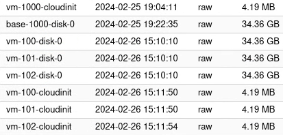
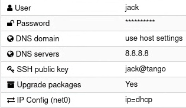
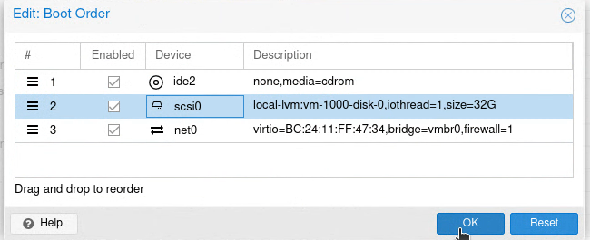
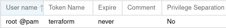
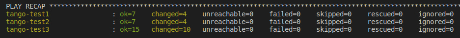
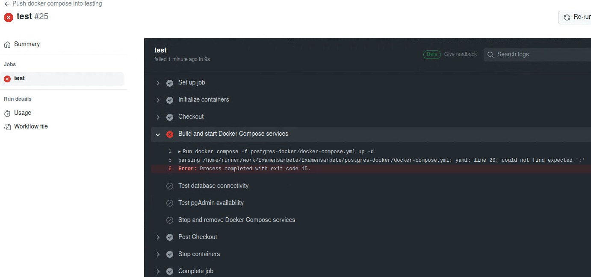
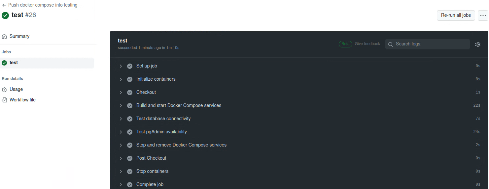

# Tango AB - Testing environment

## Configuration of Proxmox

- Version: 8.1.3
- Hostname: pve
- Username: root
- IP Address: 10.6.67.221/24
- Gateway: 10.6.67.1/24
- Port: 8006

### Storage

- local: Here is where ISO images, CT containers and backups are stored.
- local-lvm: Here is where the VM disks and corresponding cloudinit and CT volumes are stored. The templates used by the VMs are also stored here.



### VM template

In order to automate the creation of virtual machines they are cloned from a template. The image used to create the template, which the test VMs are based on, is a cloud image.  

"ubuntu-22.04-minimal-cloudimg-amd64.img" is the cloud image used to create the template "ubuntu-2204-template1" in this testing environment.

On the Proxmox node "pve" the cloud image is installed using the shell command `wget`

```bash
wget https://cloudimages.ubuntu.com/minimal/releases/jammy/release/ubuntu-22.04-minimal-cloudimg-amd64.img" 
```

#### These are the non-default settings used to create the  VM template

- Name: ubuntu-2204-template1
- VMID: 1000
- Do not use any media
- Qemu Agent: Enabled
- Delete scsi0 disk
- Add CloudInit Drive: local-lvm
- CloudInit settings
  - uses SSH public key from the client that will be running Ansible, located in ./SSH-keys
  


#### Shell

Afterwards, some shell commands are executed on the Proxmox node "pve". If a new testing template is needed, replace [vmid], [old_image_name], [image_name] and [size] with corresponding values.  

To be able to see the VM later through the console in Proxmox and configure it:  

```bash
qm set [vmid] --serial0 socket --vga serial0 
```

The image is renamed so it has the .qcow2 as the extension, otherwise Proxmox won't be able to use it:

```bash
mv [old_image_name] [image_name].qcow2" 
```

Next, the image is resized before using it in Proxmox:

```bash
qemu-img resize [image_name] [size] 
```

The template size in this environment is 32GB.

Before the disk is imported to the storage "local-lvm", the "qemu-guest-agent" is installed directly on the image, which is a daemon that exchanges information between the host and guest:

```bash
sudo apt install guestfs-tools
virt-customize –a [image_name] --install qemu-guest-agent 
qm importdisk [vmid] [image_name] local-lvm 
```

#### GUI

Now we move from the shell to the GUI, and under the template, the disk that just got imported is added:


##### Thereafter, these non-default settings are changed

- The scsi0 is enabled and the boot order is changed to this:


- Start at boot: Yes

The template is finalized after right clicking the VM "ubuntu-2204-template1" and clicking "Convert to template".

**NOTE:** After converting the VM to a template, changes can no longer be made, make sure all the desired settings are set before doing so. If the testing template needs to be updated, start over from the beginning. If a new testing template is to be created using the same cloud image, you start from this step:

```bash
qm importdisk [vmid] [image_name] local-lvm
```

### Terraform

Terraform is the tool used to provision the VMs inside this testing environment. In order to use it, an endpoint, an API-token and a provider API are needed:

- Endpoint: [10.6.67.221:8006](https://10.6.67.221:8006)
- API-token was created in Proxmox and stored in the file "credentials.tf". This is used to connect to the Proxmox node "pve" through Terraform.



- Provider API:
  - "bpg/proxmox"
  - Version: ">= 0.46.6"
  - [Source](https://registry.terraform.io/providers/bpg/proxmox/latest)

In order to provision resources on the endpoint, a client with Terraform is needed.

#### Terraform version

```bash
terraform --version
Terraform v1.7.4
on linux_amd64
```

#### Terraform configuration

`terraform apply` uses the "ubuntu-test.tf" file to provision VMs, which contains a loop that goes through a list of variables inside the "vars.tf" file.

##### vars.tf

List

```hcl
variable "vm_config" {
    type = list(object({
        idx = number
        name = string
        vmid_to_clone = number
        cpu = number
        ram = number
        size = number
    }))
```

The specifications of our VMs are written in "vars.tf"

```hcl
    default = [
    {
        idx = 0
        name = "tango-test1"
        vmid_to_clone = 1000
        cpu = 1
        ram = 2048
        size = 32
    }
```

##### ubuntu-test.tf

Loop

```hcl
    for_each = {
        for index,vm in var.vm_config:
        vm.name => vm
    }
```

Example: "each.value.ram" pulls the value "ram" from the list in "vars.tf". The VMs RAM in this case will be 2048 MB.

```hcl
    memory {
        dedicated = each.value.ram
    }
```

[Link to Code](Terraform)

#### Cloud-init

The testing template "ubuntu-2204-template1" uses Cloud-init, which means that the settings which were set applies to every VM created using said template. However, these settings can be overridden if we specify these Cloud-init settings inside the .tf file that is applied through `terraform apply`.

### Ansible

In order to configure multiple VMs, a client with Ansible is needed.

#### Ansible version

```bash
ansible --version
ansible [core 2.16.4]
  python version = 3.10.12
  jinja version = 3.0.3
```

#### Playbook

```bash
ansible-playbook playbook.yml -i inventory.ini --extra-vars "@passwd.yml" --ask-vault-pass --ssh-common-args='-o StrictHostKeyChecking=no'
```

The playbook is the "playbook.yml" file and it contains two roles: "system_update" and "docker". Using roles makes the code more modular and easier to read. Additional roles or plays to the playbook can easily be added.

The "inventory.ini" file stores variables, such as hostnames, root username and password.

Ansible Vault is set up, which encrypts files and variables. In this environment the "passwd.yml" file contains the sudo password for the client running Ansible and is encrypted using the vault password.

The argument `--extra-vars "@passwd.yml"` pulls variables from "passwd.yml", in this case the sudo password.

To be able to access the variables, the argument `--ask-vault-pass` is parsed and asks for the vault password, which unlocks the "passwd.yml" file.

The first playbook that gets executed, after the VMs are provisioned by Terraform, needs to have the argument `--ssh-common-args='-o StrictHostKeyChecking=no'` since the fresh VMs have new pairs of SSH-keys which would otherwise have to be manually approved by the client running Ansible. When running a playbook after the initial configuration, the argument can be ommited, since the keys are now stored in the client's "known_hosts" file. If the VMs are destroyed, their keys also need to be removed from "known_hosts" before being deployed again.

[Link to Code](Ansible)

### Docker

Ansible installs a docker container on the host/s specified in the "inventory.ini" file using "docker compose". The "docker compose" file sets up a PostgreSQL database on port 5432 with pgAdmin on port 8080. The volumes created by the "docker compose" are destroyed when the VM running "docker compose" is destroyed.

[Link to Code](postgres-docker)

### Deployment

#### Deploying the VMs

**NOTE:** Running the playbook immediately after using `terraform apply` can sometimes cause the playbook to fail at upgrading the VMs, since Cloud-init could still be running the intial setup and locking the /var/lib/dpkg/lock file.

The initial command is run from ./Examensarbete

```bash
cd Terraform/ && terraform apply -auto-approve
cd ../Ansible/ && ansible-playbook playbook.yml -i inventory.ini --extra-vars "@passwd.yml" --ask-vault-pass --ssh-common-args='-o StrictHostKeyChecking=no'
```

It takes around two and half minutes to provision three VMs.

```bash
Plan: 3 to add, 0 to change, 0 to destroy. 

proxmox_virtual_environment_vm.tango-test["tango-test3"]: Creating... 

proxmox_virtual_environment_vm.tango-test["tango-test1"]: Creating... 

proxmox_virtual_environment_vm.tango-test["tango-test2"]: Creating... 
elapsed] 

proxmox_virtual_environment_vm.tango-test["tango-test3"]: Creation complete after 2m12s [id=101] 

proxmox_virtual_environment_vm.tango-test["tango-test2"]: Creation complete after 2m12s [id=102] 

proxmox_virtual_environment_vm.tango-test["tango-test1"]: Creation complete after 2m17s [id=100] 

Apply complete! Resources: 3 added, 0 changed, 0 destroyed. 
```

The initial configuration of the VMs takes around two minutes.



#### Destroying the VMs

```bash
cd Terraform/ && terraform apply -destroy -auto-approve
```

```bash
Plan: 0 to add, 0 to change, 3 to destroy. 

proxmox_virtual_environment_vm.tango-test["tango-test3"]: Destroying... [id=101] 

proxmox_virtual_environment_vm.tango-test["tango-test2"]: Destroying... [id=102] 

proxmox_virtual_environment_vm.tango-test["tango-test1"]: Destroying... [id=100] 

proxmox_virtual_environment_vm.tango-test["tango-test3"]: Destruction complete after 7s 

proxmox_virtual_environment_vm.tango-test["tango-test2"]: Destruction complete after 7s 

proxmox_virtual_environment_vm.tango-test["tango-test1"]: Destruction complete after 7s 

Apply complete! Resources: 0 added, 0 changed, 3 destroyed. 
```

Before deploying again, manually remove the hosts SSH-keys from the "./ssh/known_hosts" file.

### GitHub

This environment is split into two branches: "main" and "testing". The main branch is representing a production branch and the testing branch is where changes to the code are initially commited and tested. Before merging the two, the code that is commited to the testing branch should pass all checks, afterwards the pull request needs to be manually approved.

#### Configuration of GitHub Actions

GitHub Actions is a CI/CD tool. There are several workflows in this environment. A workflow tests code on a runner provided by GitHub, also if specified, the runner can spin up a container to test changes made to code. All workflows used in this testing environment can be found on the GitHub Marketplace, except the "docker-compose-test".

#### Workflows

Every workflow gets triggered when pushing commits to the testing branch.

- The "actionlint.yml" checks syntax on commited changes to a workflow inside the .github/workflows directory. [Source](https://github.com/marketplace/actions/rhysd-actionlint)

- The "ansible-lint.yml" checks the syntax on commited changes to all files with the ".yml" extension inside the ./Ansible directory. [Source](https://github.com/marketplace/actions/run-ansible-lint)

- The "tflint.yml" checks syntax on all files with file extension ".tf" inside the ./Terraform directory. [Source](https://github.com/marketplace/actions/setup-tflint)

- The "docker-compose-test" checks commited changes made to the "docker-compose.yml".

#### Workflow example

A workflow gets triggered on push to the branch "testing", when changes are made to "postgres-docker/docker-compose.yml".

```yml
name: Push docker compose into testing

"on":
  push:
    branches: [testing]
    paths: [postgres-docker/docker-compose.yml]
```

GitHub runs docker on an Ubuntu runner with specified ports.

```yml
jobs:
  test:
    runs-on: ubuntu-latest
    services:
      docker:
        image: docker:25.0.3
        ports:
          - 5432:5432
          - 8080:80
```

The checkout pulls the code from our repository, runs docker compose, tests the connectivity to the database "postgres" on port 5432 with the user "jack", afterwards tests if the pgAdmin page is available with wget, then stops and cleans up everything.

```yml
    steps:
      - name: Checkout
        uses: actions/checkout@v4

      - name: Build and start Docker Compose services
        run: |
          docker compose -f postgres-docker/docker-compose.yml up -d
          docker compose -f postgres-docker/docker-compose.yml ps
      
      - name: Test database connectivity
        run: |
          sudo apt install -y postgresql-client
          pg_isready -d postgres -h localhost -p 5432 -U jack

      - name: Test service availability
        run: |
          wget --spider http://localhost:8080

      - name: Stop and remove Docker Compose services
        run: docker compose -f postgres-docker/docker-compose.yml down
```

Example of workflow failing and giving an error code, making it easier to troubleshoot.



Example of workflow succeding:



#### Cost

Every commit which is affected by either one of these workflows takes around 30-60 seconds for a runner to test. Every workflow that runs under 60 seconds gets billed as 1 minute. With the GitHub Team subscription the team gets 5000 CI/CD minutes/per month in total.

[Link to Code](.github/workflows)
