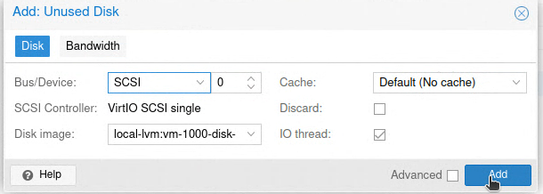

# Tango AB - Test environment

## Configuration of Proxmox

Version: 8.1.3
Hostname: pve
Username: root
IP Address: 10.6.67.221  
API-token used by Terraform in order to provision machines on the Proxmox node "pve":


### Storage

local: Here is where ISO images, CT containers and backups are stored.
local-lvm: Here is where the VM disks and corresponding cloudinit and CT volumes are stored. Also templates used by the VMs are stored here.


### Creating a VM template

In order to automate the creation of virtual machines they need to be cloned from a template. The image used to create the template, which the test VMs are based on, is a cloud image.  

On the Proxmox node "pve" run the shell command "wget" + the link of the cloud image.

For example, the cloud image used to create the template in this test environment:

```bash
wget https://cloudimages.ubuntu.com/minimal/releases/jammy/release/ubuntu-22.04-minimal-cloudimg-amd64.img" 
```

#### These are the non-default settings used to create the  VM template:

- Name: ubuntu-2204-template1
- VMID: 1000
- Do not use any media
- Qemu Agent: Enabled
- Delete scsi0 disk.
- Add CloudInit Drive: local-lvm
- CloudInit settings:


#### Shell
Afterwards, some shell commands needs to be executed on the Proxmox node "pve". Replace [vmid], [old_image_name] and [image_name] with corresponding values.  

To be able to see the VM later through the console in Proxmox, run this shell command:  

```bash
qm set [vmid] --serial0 socket --vga serial0 
```

The image needs to be renamed so it has the .qcow2 as the extension, otherwise Proxmox won't be able to use it:

```bash
mv [old_image_name] [image_name].qcow2" 
```

Next, resize image before using it in Proxmox, this template size will be 32GB: 

```bash
qemu-img resize [image_name] 32G 
``` 
Before importing the disk to our storage "local-lvm" the "qemu-guest-agent" is installed directly on the image, which is a daemon that exchanges information between the host and guest:

```bash
sudo apt install guestfs-tools
virt-customize –a [image_name] --install qemu-guest-agent 
qm importdisk [vmid] [image_name] local-lvm 
```

#### GUI
Now we move from the shell to the GUI, and under the template, add the disk that just got imported: 


##### Thereafter, these non-default settings are changed
- Change boot order:


- Start at boot: Yes

**WARNING:** Make sure all the desired settings are set, since they can't be changed after the template is created. Finally, right click the VM "ubuntu-2204-template1" and convert to template.  
 
If you're creating another template based on the same image you start from this step:

```bash
qm importdisk [vmid] [image_name] local-lvm
```

### Cloud-init
The VMs created through one of the 

 
Configuration of Terraform 
Installation of Terraform 
 
### Terraform 
Provider API for proxmox 
Create an API-token in Proxmox 
f337998e-a057-44f1-bf6f-32bcd68031e9 
 
### Ansible 
#### Installation and configuration of Ansible
 
This command is used  
 
ansible-playbook playbook.yml -i inventory.ini --extra-vars "@passwd.yml" --ask-vault-pass --ssh-common-args='-o StrictHostKeyChecking=no' 


### Docker 
Docker 
Docker Compose 
 
### Configuration of Github 
 
#### Configuration of Github Actions 
Github Actions CI/CD 
Runners 
Workflows 
Ansible-lint 
.yml 
Testing 
Changes in docker-compose triggers a workflow that spins up a docker container and tests the code 
 
### Deployment 

```bash
cd Terraform/ && terraform apply -auto-approve && cd .. && ansible-playbook playbook.yml -i inventory.ini --extra-vars "@passwd.yml" --ask-vault-pass --ssh-common-args='-o StrictHostKeyChecking=no'
```


